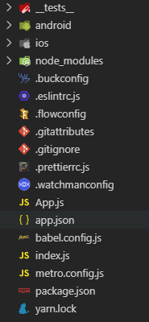

## 脚手架截图

  

#### tests：测试文件夹，执行命令 “npm test”会调用此文件夹，在文件夹中需要引入待测试文件。

#### android：Android 的原生开发目录，可以用 Android Studio 打开进行原生开发

#### ios: Ios 的原生开发目录，可以用 Xcode 打开进行原生开发

#### node_modules: 存放所有的项目依赖库

#### .buckconfig: buck 的配置文件，buck 是 Facebook 推出的一款高效率的 App 项目构建工具

#### .eslintrc.js: 代码格式校验（同 vue-cli）

#### .flowconfig: Flow 是 Facebook 旗下一个为 JavaScript 进行静态类型检测的检测工具。它可以在 JavaScript 的项目中用来捕获常见的 bugs，比如隐式类型转换，空引用等等

#### .gitattributes: git 属性文件设定一些项目特殊的属性。比如要比较文档的不同；对 strings 程序进行注册；合并冲突的时候不想合并某些文件等等。

#### .gitignore: 用来配置 git 提交需要忽略的文件

#### .watchmanconfig: 用于监控 bug 文件和文件变化，并且可以出发指定的操作

#### .prettierrc.js：配置代码格式、tab 缩进等

#### app.json: 配置了 name 和 displayName

#### babel.config.js:设置 babel

#### index.js：入口文件，相当于 vue-cli 中的 main.js

#### metro.config.js:可以自主配置打包方式，我们可以根据实际的需要来控制打包过程中的一些需求（详细可查看官网）

#### package.json：配置信息、项目依赖，

#### yarn.lock : 由 Facebook 创建的新 JavaScript 包管理器；每次添加依赖或者更新包版本，yarn 都会把相关版本信息写入 yarn.lock 文件。这样可以解决同一个项目在不同机器上环境不一致的问题

#### src：components、icon 、 navigator 、utils 、store
